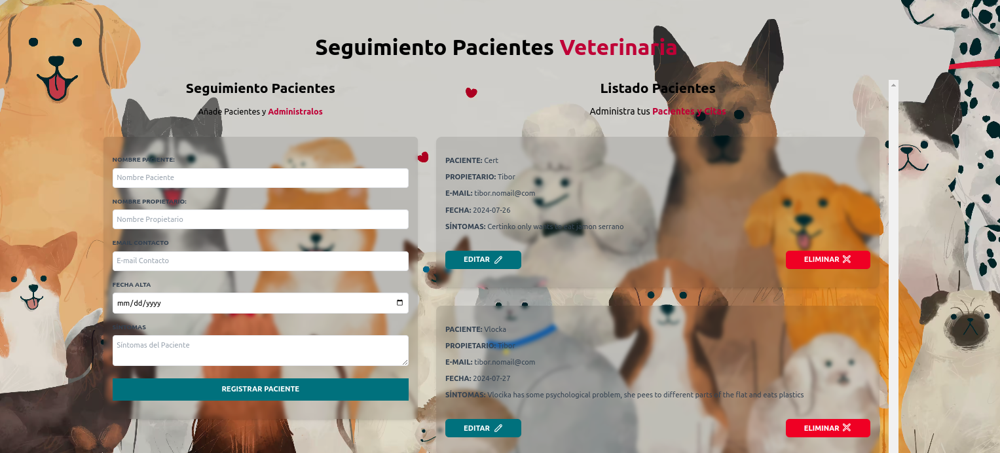

# Veterinary Appointment Booking WebApp
### Practice of the Javascript, HTML, Tailwind CSS

## Description & Functionality
* using js Object literal, Classes and Methods
* validation of all input fields of the form for empty values, and date validation (date must be in the future)
* using local storage to store data to show the data onload
* using event listeners to add, edit and delete appointments
* update local storage data on edit of the appointment
* dynamically generating html elements and messages
* using Tailwind classes to style alert messages

## Screenshot
>Final Online Website Screenshot

## Online Link
[github Pages Link](https://tiborkopca.github.io/Javascript2024-Vet-Appointment-App/)

## Authors

- [@TiborKopca](https://github.com/TiborKopca)
